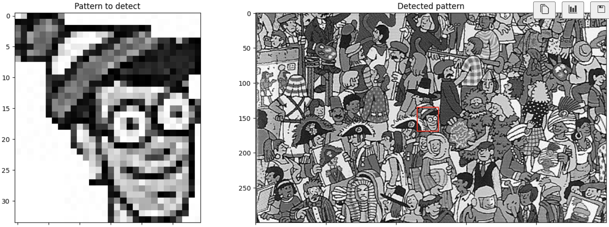
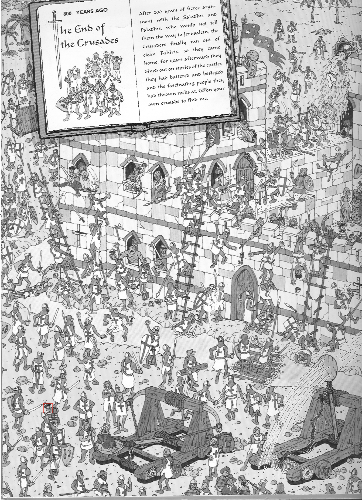

# Waldoko

_Waldoko_ is funny side project I imagined during my 2D signal processing class. I wanted to crack the famous game "Where's Waldo" using image processing techniques. The idea is to use a pattern matching algorithm to find Waldo in the image.

> Why "Waldoko"? Because it's a mix between "Waldo" and "doko" (Japanese for "where").

## Quick Overview

The project is divided into two main parts:

1. **Pattern Building**: We need to build a pattern from the image of Waldo. This pattern will be used to find Waldo in every other images.
   So from the very start, from learning how to open a picture in Python, to the final pattern, we will go through the following steps: - Open the image - Convert it to grayscale - Detect the edges - Find the contours - Draw the bounding box - Extract the pattern

> It _was_ the plan, but I'm lazy and I've done it manually. Check the 1st ipynb for more details.
> I'm letting room for improvement here, but I'm not sure I'll ever come back to this project.

2. **Pattern Matching**: We will use the pattern to find Waldo in the other images. I used the phase correlation algorithm to find the pattern in the images. The phase correlation is a technique used to find the translation between two images. It's often used in image registration, but it can also be used to find a pattern in an image.

## Results

I've tested the algorithm on a few images and it worked pretty well but to be honest, a good old CNN would have done the job better. But it was fun to try something different.

